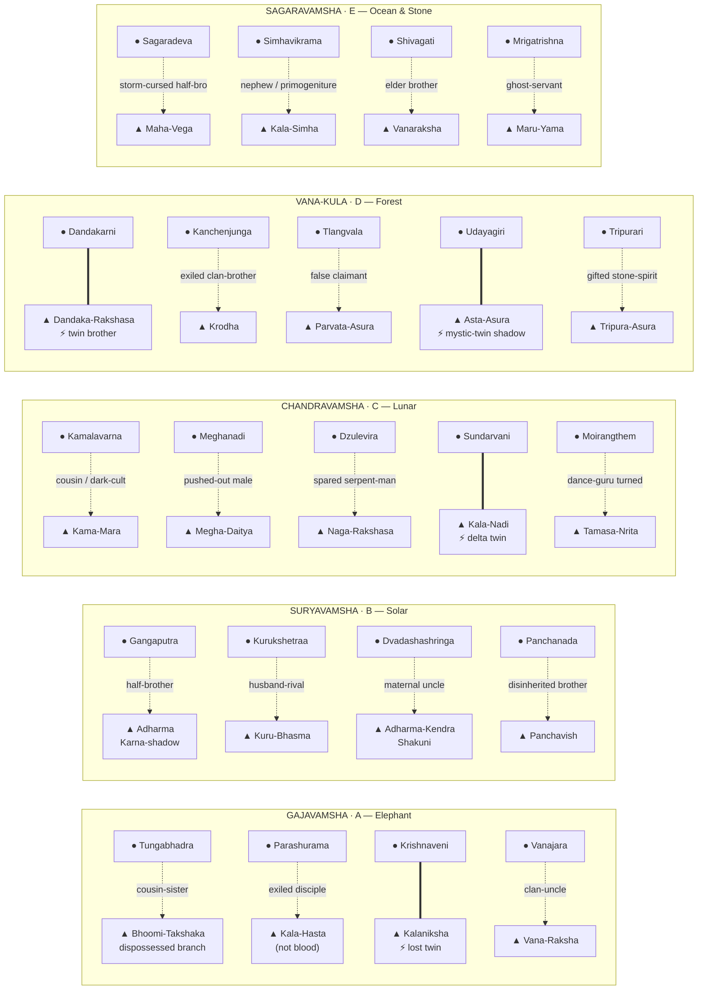
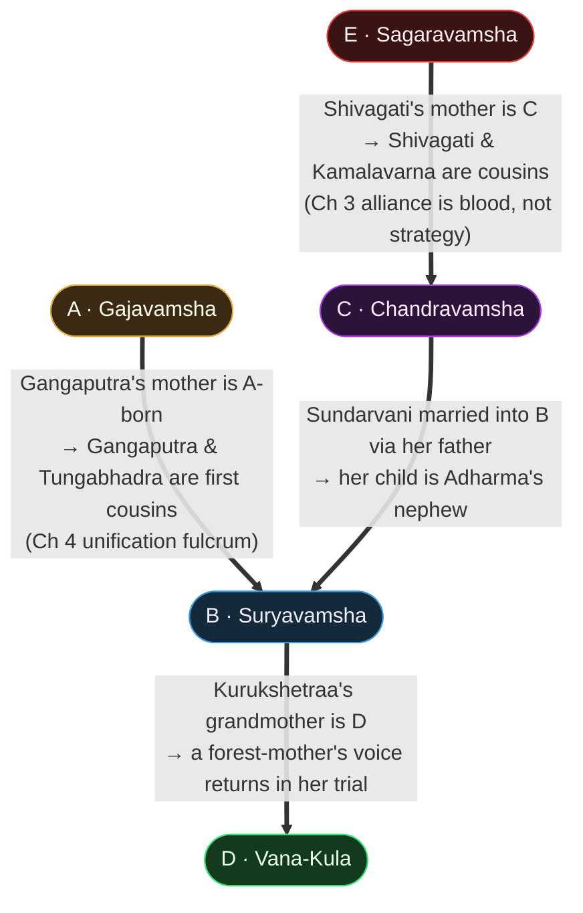
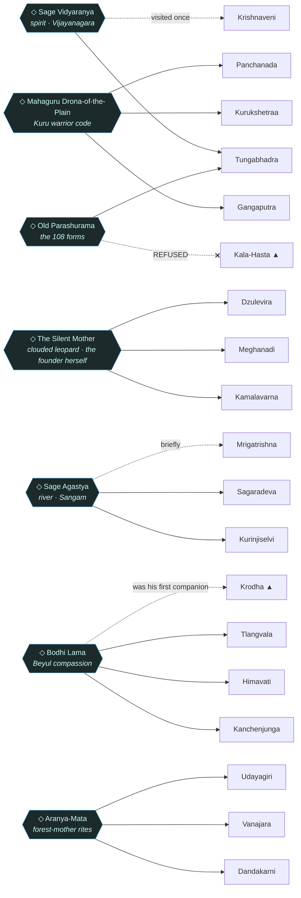
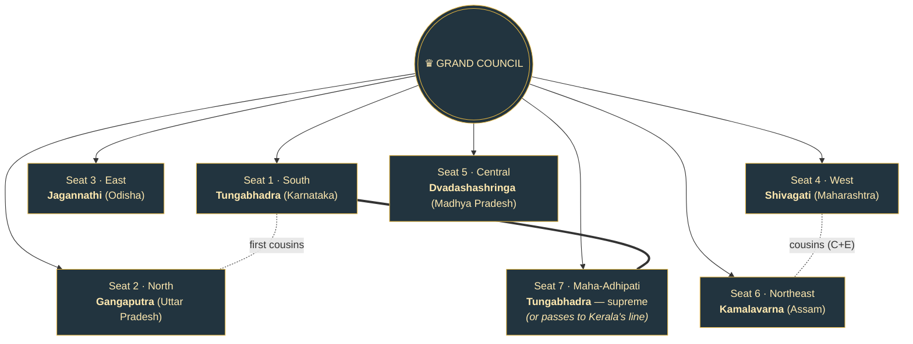
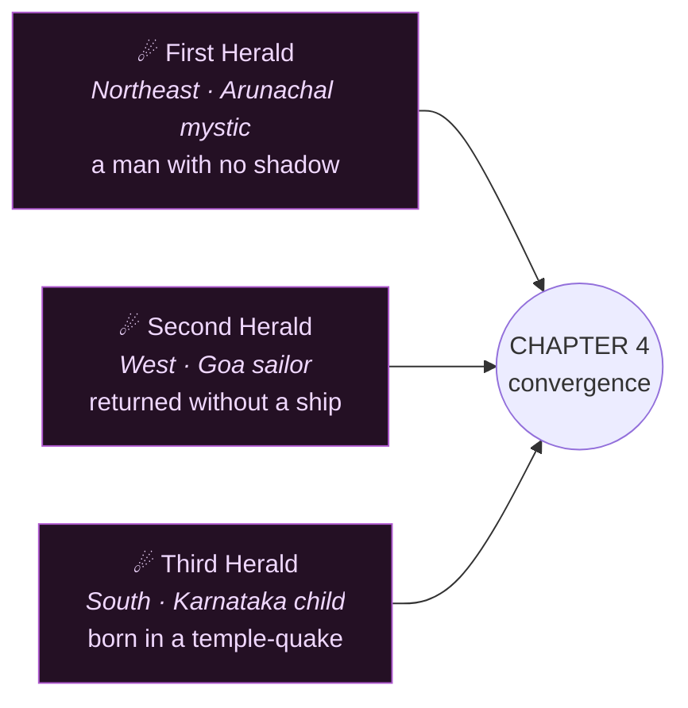

# Volume I · Maha Parva — The Connection Tree

> *The Mahabharata's power is not in its battles — it is in the fact that everyone in it is related.*
> Cousins fight cousins. Gurus teach both sides. Mothers shelter rivals.

This is the master family / connection map for **all 30 kingdoms** of Volume I, spanning
Chapters 1–4. It is derived from the Chapter-1 canon (`heroes.csv`, `villains.csv`,
`characters-data.js`) and the planning graph (`_planning/02-relationship-graph.md`).

An **interactive** version lives at
[chapter-1/connections.html](content/volume-1-maha-parva/chapter-1-rise-of-legends/connections.html)
(pan / zoom / click a node).

**Legend**
`◆ founder` · `● hero` · `▲ villain` · `◇ guru` · `♛ Grand-Council seat` · `☄ Void-Maw herald`
Solid line = blood descent · dashed = marriage / cross-bloodline · dotted = guru teaches · ⚡ = twins

---

## 1. The Five Bloodlines (descent tree)

```mermaid
flowchart TD
  ANC(("◆ GREAT-ANCESTOR<br/>mythic, unnamed"))

  ANC --> A["◆ GAJAVAMSHA · A<br/><i>Elephant Lineage</i><br/>South + East coast"]
  ANC --> B["◆ SURYAVAMSHA · B<br/><i>Solar Line</i><br/>North + Central"]
  ANC --> C["◆ CHANDRAVAMSHA · C<br/><i>Lunar / matrilineal</i><br/>Northeast + Bengal"]
  ANC --> D["◆ VANA-KULA · D<br/><i>Forest Clan</i><br/>Central + forest belt"]
  ANC --> E["◆ SAGARAVAMSHA · E<br/><i>Ocean & Stone</i><br/>West + South coast"]

  %% --- Bloodline A ---
  A --> A1["● Tungabhadra ♛<br/><i>Karnataka</i> · Maha-Empress / heir"]
  A --> A2["● Parashurama ◇<br/><i>Kerala</i> · granduncle, eldest elder"]
  A --> A3["● Krishnaveni<br/><i>Andhra Pradesh</i> · half-sister of Tungabhadra"]
  A --> A4["● Vanajara<br/><i>Jharkhand</i> · distant cousin (also Vana-Kula)"]

  %% --- Bloodline B ---
  B --> B1["● Gangaputra ♛<br/><i>Uttar Pradesh</i> · throne-heir (Arjuna)"]
  B --> B2["● Dvadashashringa ♛<br/><i>Madhya Pradesh</i> · younger half-brother"]
  B --> B3["● Kurukshetraa<br/><i>Haryana</i> · first cousin"]
  B --> B4["● Panchanada<br/><i>Punjab</i> · cousin (Kuru-Panchala)"]
  B --> B5["● Sharad-Pandit<br/><i>Kashmir</i> · added scholar-branch"]

  %% --- Bloodline C ---
  C --> C1["● Kamalavarna ♛ ◇<br/><i>Assam</i> · matriarch of the line"]
  C --> C2["● Meghanadi<br/><i>Meghalaya</i> · younger sister"]
  C --> C3["● Dzulevira<br/><i>Nagaland</i> · niece"]
  C --> C4["● Sundarvani<br/><i>West Bengal</i> · delta cousin"]
  C --> C5["● Moirangthem<br/><i>Manipur</i> · cousin (Sangai house)"]

  %% --- Bloodline D ---
  D --> D1["● Dandakarni<br/><i>Chhattisgarh</i> · living head of the wild"]
  D --> D2["● Kanchenjunga<br/><i>Sikkim</i> · forest cousin"]
  D --> D3["● Tlangvala<br/><i>Mizoram</i> · southern remnant"]
  D --> D4["● Udayagiri<br/><i>Arunachal</i> · rising-sun cousin"]
  D --> D5["● Tripurari<br/><i>Tripura</i> · three-cities cousin"]
  D --> A4

  %% --- Bloodline E ---
  E --> E1["● Sagaradeva ☄<br/><i>Goa</i> · direct heir"]
  E --> E2["● Simhavikrama<br/><i>Gujarat</i> · desert-edge cousin"]
  E --> E3["● Shivagati ♛<br/><i>Maharashtra</i> · mountain niece"]
  E --> E4["● Mrigatrishna<br/><i>Rajasthan</i> · desert-queen cousin"]
  E --> E5["● Onge-Nakshatra<br/><i>Andaman</i> · added ocean-branch"]

  classDef founder fill:#2a1c33,stroke:#c44daa,color:#f3d9ee,font-weight:bold;
  classDef seat fill:#22343f,stroke:#e0b341,color:#ffe9b0;
  class ANC,A,B,C,D,E founder;
  class A1,B1,B2,C1,E3 seat;
```

> **Bloodline-A note (restructure):** after Tungabhadra falls in late Ch 2 her elephant-bond
> and the line's headship pass to **Krishnadevaraya-Bhrata** — the line survives the empress.

---

## 2. Each Bloodline's Hero ⚔ Villain Web

The line's light and shadow. ▲ villains are listed against the hero they shadow.

---

## 3. Cross-Bloodline Marriages — the six-pointed star

Every line touches at least two others. These unions are the Chapter 2–4 loyalty bombs.

---

## 4. The Council of Gurus (each teaches across kingdoms)

> Each guru carries a hidden truth (a Chekhov's gun that must explode by Ch 4): Vidyaranya was
> married to Bhoomi-Takshaka's grandmother; Drona's true debt is to **Adharma-Kendra**;
> Agastya knows where the Sangam text that *names the Void Maw* is hidden.

---

## 5. The Grand Council — seven seats (Chapter 4 target)

> The seven are **not strangers**: Tungabhadra & Gangaputra are first cousins; Kamalavarna &
> Shivagati are cousins. Chapter 4's "unification" is partly a family reunion under duress.

---

## 6. The Void Maw Heralds (Ch 2 → Ch 4)

Not villains — *warnings*. Killing one accelerates the Void Maw's arrival. They converge in Ch 4.

---

## 7. The Unaligned Houses (bloodline emerges later)

Six Chapter-1 kingdoms are not yet placed in a bloodline by the planning graph. They carry the
Mahabharata mirror-roles below and acquire their ancestral claims in Ch 2+.

| Kingdom | Hero | Villain | Mahabharata mirror | Hook |
|---|---|---|---|---|
| Telangana (Chaya-Golkonda) | Chittaranga | Chitrabheda | Arjuna / Shakuni | ⚡ lost twin sister **Chitralekha** leads an eastern shadow guild |
| Tamil Nadu (Sangam Tamilakam) | Kurinjiselvi | Palinisi | Draupadi | student of **Sage Agastya** (Sangam texts) |
| Uttarakhand (Deva-Bhumi) | Kasturika | Hima-Mara | — | Mountain Pact with Himachal + Sikkim |
| Himachal (Hima-Chhaya) | Himavati | Hima-Asura | Draupadi | student of **Bodhi Lama** |
| Odisha (Kalinga-Chakra) | Jagannathi | Chakra-Bheda | Yudhishthira | **holds Grand-Council Seat 3 (East)** |
| Bihar (Vajra-Bhumi) | Vajramukha | Tamasa | Bhima | River-Sisters pact with WB + UP |

---

## 8. New cast introduced for Ch 2–4

- **Hampi-of-the-Bronze** — Tungabhadra's young ward; becomes her Ch 3 conscience.
- **Yamunadatta** — Gangaputra × an A-noblewoman's son; spark for the UP civil war.
- **Aranya-Putri** — Dandakarni's adopted forest-daughter; spark for the urban/tribal split.
- **Sangaputra** — Moirangthem × Dzulevira's elder sister's child; the Manipur–Nagaland weave.
- **Vyasa-of-the-Margins** — chronicler-monk in every region; the Maha-Adhipati's witness (not a candidate).
- **The Six Regional Marshals** — one per region; sacrificial — their Ch 3 deaths buy each Dominant the regional seat.

---

*Generated from canon + planning graph. To regenerate the interactive page after edits, run
`python3 tools/build_site.py`.*
